  

 

Industrial Automation Engineering interested in functional safety, OT cybersecurity, and systems architecture.

Focused on interoperability between safety and cybersecurity, as well as bridging IT and OT environments, including the integration of legacy and modern industrial systems and industrial protocols through the OSI model.

---

## Framework

### Architecture
- **Purdue Reference Model** — zone/level decomposition, network segmentation
- **ISA-95** — enterprise-to-control integration, functional hierarchy
- **OSI Model** — protocol stack analysis, industrial protocol mapping, and IT/OT communication understanding

### Safety & Security
- **IEC 62443** — OT cybersecurity, zone/conduit modeling, security levels
- **IEC 61508** — functional safety, SIL determination, safety lifecycle

---

Industrial Automation Engineering · OT/ICS · Industry 4.0 & 5.0

